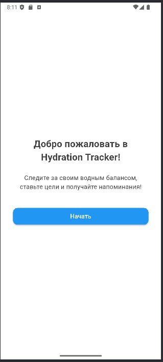

# Hydration Tracking Application

A cross-platform hydration tracking solution featuring a Go microservices backend and a Flutter frontend. The project is containerized with Docker and includes PostgreSQL, Redis, and Nginx for a robust, production-ready stack.

---
## Implementation checklist

### Technical requirements (20 points)
#### Backend development (8 points)
- [ ] Go-based microservices architecture (minimum 3 services) (3 points)
- [ ] RESTful API with Swagger documentation (1 point)
- [ ] gRPC implementation for communication between microservices (1 point)
- [ ] PostgreSQL database with proper schema design (1 point)
- [ ] JWT-based authentication and authorization (1 point)
- [ ] Comprehensive unit and integration tests (1 point)

#### Frontend development (8 points)
- [ ] Flutter-based cross-platform application (mobile + web) (3 points)
- [ ] Responsive UI design with custom widgets (1 point)
- [ ] State management implementation (1 point)
- [ ] Offline data persistence (1 point)
- [ ] Unit and widget tests (1 point)
- [ ] Support light and dark mode (1 point)

#### DevOps & deployment (4 points)
- [ ] Docker compose for all services (1 point)
- [ ] CI/CD pipeline implementation (1 point)
- [ ] Environment configuration management using config files (1 point)
- [ ] GitHub pages for the project (1 point)

### Non-Technical Requirements (10 points)
#### Project management (4 points)
- [ ] GitHub organization with well-maintained repository (1 point)
- [ ] Regular commits and meaningful pull requests from all team members (1 point)
- [ ] Project board (GitHub Projects) with task tracking (1 point)
- [ ] Team member roles and responsibilities documentation (1 point)

#### Documentation (4 points)
- [ ] Project overview and setup instructions (1 point)
- [ ] Screenshots and GIFs of key features (1 point)
- [ ] API documentation (1 point)
- [ ] Architecture diagrams and explanations (1 point)

#### Code quality (2 points)
- [ ] Consistent code style and formatting during CI/CD pipeline (1 point)
- [ ] Code review participation and resolution (1 point)

### Bonus Features (up to 10 points)
- [ ] Localization for Russian (RU) and English (ENG) languages (2 points)
- [ ] Good UI/UX design (up to 3 points)
- [ ] Integration with external APIs (fitness trackers, health devices) (up to 5 points)
- [ ] Comprehensive error handling and user feedback (up to 2 points)
- [ ] Advanced animations and transitions (up to 3 points)
- [ ] Widget implementation for native mobile elements (up to 2 points)

Total points implemented: XX/30 (excluding bonus points)
---
## For Users

**What is this app for?**

This application helps you monitor and improve your daily water intake. You can:
- Register and log in securely
- Record every glass or bottle of water you drink
- Set and track your daily hydration goals
- View detailed statistics and progress charts
- Use the app on web or mobile (Android/iOS)
- Access your data offline and sync when online

The app is designed for convenience, privacy, and motivation to help you stay healthy and hydrated every day.

---

## 🧑‍💻 User Features & Screenshots

### 1. Onboarding
New users are greeted with an onboarding flow that explains the app's benefits and guides them through initial setup.



### 2. Registration & Login
Create a new account or log in securely to access your personal hydration data from any device.


### 3. Hydration Tracker
Easily log every glass or bottle of water you drink. The main dashboard shows your daily progress and quick-add buttons for common amounts.


### 4. Settings & Personalization
Customize your daily hydration goal, switch between light and dark themes, and manage notification preferences.


---

## 🏗️ Architecture

### Backend (Go)
- **auth-service** (port 8081): JWT authentication, registration, and login
- **hydration-service** (port 8082): Water intake logging, statistics, and daily goals
- **PostgreSQL** (port 5432): Main relational database
- **Redis** (port 6379): Caching and session storage
- **Nginx** (port 80/443): API gateway (reverse proxy)
- **Swagger UI**: Auto-generated API documentation for each service

### Frontend (Flutter)
- **Flutter Web** (port 3000): Single-page application for browsers
- **Flutter Mobile**: Android/iOS (manual run)
- **State Management**: Riverpod
- **Offline Support**: SQLite
- **Themes**: Light and dark

## 🔒 Security Features

- JWT-based authentication
- Password hashing (bcrypt in production)
- Rate limiting
- CORS configuration
- Input validation
- SQL injection prevention
- XSS protection headers

## 📊 Monitoring & Logging

- Structured logging with different levels
- Health check endpoints
- Metrics collection (Prometheus ready)
- Error tracking and reporting

## 📋 Prerequisites

- Docker and Docker Compose
- Go 1.21+
- Flutter 3.16.0+
- PostgreSQL 15+
- Redis 7+

---

## 🚀 Quick Start

### 1. Clone the Repository
```sh
git clone https://github.com/yourusername/hydration-tracking.git
cd hydration-tracking
```

### 2. Start All Services with Docker (Recommended)
```sh
docker-compose up -d
```
This will start:
- PostgreSQL (5432)
- Redis (6379)
- Auth Service (8081)
- Hydration Service (8082)
- Nginx (80/443)
- Flutter Web (3000)

### 3. Access Points
- **Web App**: http://localhost:3000
- **Swagger Auth**: http://localhost:8081/swagger/index.html
- **Swagger Hydration**: http://localhost:8082/swagger/index.html

---

## 🛠️ Manual Backend Setup

### Install Dependencies
```sh
cd backend
go mod download
```

### Configure Environment Variables
```sh
cp config.env.example config.env
# Edit config.env as needed (DB_HOST, DB_USER, DB_PASSWORD, etc.)
```

### Run Services Individually
```sh
# Auth Service
go run services/auth/server.go

# Hydration Service
go run services/hydration/server.go
```

---

## 🛠️ Manual Frontend Setup

```sh
cd frontend
flutter pub get

# For Web
flutter run -d chrome

# For Android (emulator)
flutter run -d android

# For iOS (Mac)
flutter run -d ios
```

---

## 🧪 Testing

### Backend
```sh
cd backend
go test -v ./services/auth/...
go test -v ./services/hydration/...
```

### Frontend
```sh
cd frontend
flutter test
```

---

## 📚 API Documentation (Swagger)

### Auth Service (8081)
- `POST /api/v1/register` — Register a new user
- `POST /api/v1/login` — User login
- `GET /api/v1/profile` — Get user profile (JWT required)

### Hydration Service (8082)
- `POST /api/v1/entries` — Add hydration entry (JWT required)
- `GET /api/v1/entries` — Get user entries (JWT required)
- `GET /api/v1/stats` — Get hydration statistics (JWT required)
- `PUT /api/v1/goal` — Update daily goal (JWT required)

---

## 🗄️ Database Schema

**users**
```sql
CREATE TABLE users (
    id UUID PRIMARY KEY,
    username VARCHAR(50) UNIQUE NOT NULL,
    email VARCHAR(100) UNIQUE NOT NULL,
    password VARCHAR(255) NOT NULL,
    created_at TIMESTAMP DEFAULT CURRENT_TIMESTAMP
);
```
**hydration_entries**
```sql
CREATE TABLE hydration_entries (
    id UUID PRIMARY KEY,
    user_id UUID NOT NULL,
    amount INTEGER NOT NULL,
    timestamp TIMESTAMP DEFAULT CURRENT_TIMESTAMP,
    type VARCHAR(50) NOT NULL,
    FOREIGN KEY (user_id) REFERENCES users(id)
);
```
**user_goals**
```sql
CREATE TABLE user_goals (
    user_id UUID PRIMARY KEY,
    daily_goal INTEGER DEFAULT 2000,
    created_at TIMESTAMP DEFAULT CURRENT_TIMESTAMP,
    updated_at TIMESTAMP DEFAULT CURRENT_TIMESTAMP,
    FOREIGN KEY (user_id) REFERENCES users(id)
);
```

---

## ⚙️ Environment Variables

- `DB_HOST`, `DB_PORT`, `DB_NAME`, `DB_USER`, `DB_PASSWORD`
- `JWT_SECRET` (for auth-service)
- `REDIS_HOST`, `REDIS_PORT`

---

## 🐳 CI/CD

- All tests are run via GitHub Actions (Go + Flutter)
- Go tests use a mock database; no real database is required
- Flutter tests require Chrome (for web) or an emulator

---

## ❗ Notes

- All service ports and paths are defined in `docker-compose.yml` and Swagger UI
- For Android emulator, use IP `10.0.2.2` to access backend services, not localhost's

---

## 🐳 Troubleshooting

To view logs for a specific service:
```sh
docker-compose logs -f auth-service
docker-compose logs -f hydration-service
```
